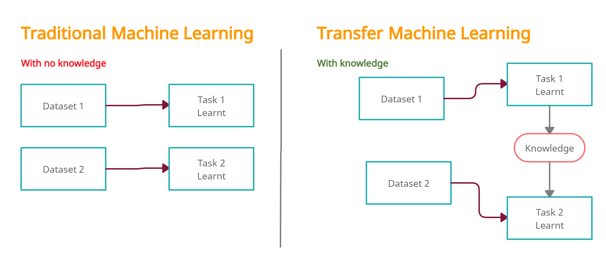

# Fruits and Veggies Recognition

A new Transfer Machine Learning Flutter project.

## Getting Started

This project is a starting point for a Transfer Machine Learning Flutter application.

A few resources to get you started if this is Transfer Machine Learning Flutter project:

- [Tensorflow: transfer machine learning](https://www.tensorflow.org/)

For help getting started with Flutter, view our
[online documentation](https://flutter.dev/docs), which offers tutorials,
samples, guidance on mobile development, and a full API reference.
